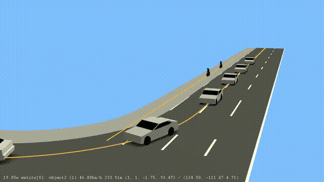

Hi, we are thireks!

We provide traffic data sets including conflict scenarios using our causal generative AI traffic simulation solution.

The current sample consists of conflict scenarios with cyclists during urban right turns:

<p align="center">
  
</p>
The data is provided in the OpenSCENARIO format including OpenDRIVE files.

We recommend to use the following command to run the scenarios in esmini (please ensure that the esmini executable is in your PATH):
```
esmini --window 60 60 1024 576 --osc '.\xosc\thireks(1).xosc' --info_text 2 --plot --fixed_timestep 0.1
```
For further information don't hesitate to reach out to us: info@thireks.de

Your thireks-team